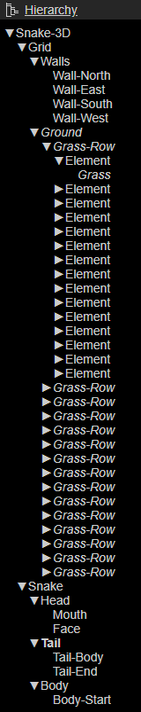

# Snake-3D_PRIMA_Mantay
This repository is my final submission-project "Snake 3D" for the module *P.R.I.M.A* at Hochschule Furtwangen.

## Information of project
- Title: Snake 3D
- Author: Tim Mantay
- Year and season: Summerterm 2022 
- Curriculum and semester: AIN6
- Course: Prototyping interactive media-applications and games (P.R.I.M.A)
- Docent: Prof. Dipl.-Ing. Jirka R. Dell'Oro-Friedl

- Finished Project: [Snake 3D - GitHub Pages](https://feinerkuchen567.github.io/Snake-3D/index.html)
- Source code: [Snake 3D - Reposiotory](https://github.com/FeinerKuchen567/Snake-3D)
- Design document: [Konzept](https://github.com/FeinerKuchen567/Snake-3D/tree/master/Konzept)
- Description - how to interact: Use *W* *A* *S* *D* to move. The Movement of the body is buggy, but it works most of the times.

## Checkliste 
© Prof. Dipl.-Ing. Jirka R. Dell'Oro-Friedl, HFU
| Nr | Criterion           | Explanation                                                                                                         |
|---:|---------------------|---------------------------------------------------------------------------------------------------------------------|
|  1 | Units and Positions | 0 is the bottom left grid point and 1 is the measurement for any other grid points |
|  2 | Hierarchy           |    On runtime more Nodes gets added to the *Body*-Node. And a the *Food*-Node gats attached  to the *Snake-3D*-Graph. |
|  3 | Editor              | All the initial design is done in the editor, whilst the extension of the snake is better done by coding. The *Food* is also done by Code to add an CustomEvent. |
|  4 | Scriptcomponents    | The movement of the body is done by SC, because of the turning were every body-part now moves in a different direction till the point of turning |
|  5 | Extend              | *BodyPart* is a extension of ComponentScript; *GameState* extends the Mutable-Class; *Food* extends the Node-Class |
|  6 | Sound               | Snake-Thema-Music & Eating-SFX & GameOver-Music  - the Listener is placed on the Head-Node to follow the Head |
|  7 | VUI                 | Sound Control for the Thema-Music + Game-SFX |
|  8 | Event-System        | A *CustomEvent* gives the signal for the food to reposition, and another event handles the extension of the body. |
|  9 | External Data       | The speed-factor for the movement is saved in a *config.json* |
|  A | Light               | I placed two *Directional* lights in a way where edges of the mesh are visible. And a little bit of *Ambient* light to not leave any surface black. |